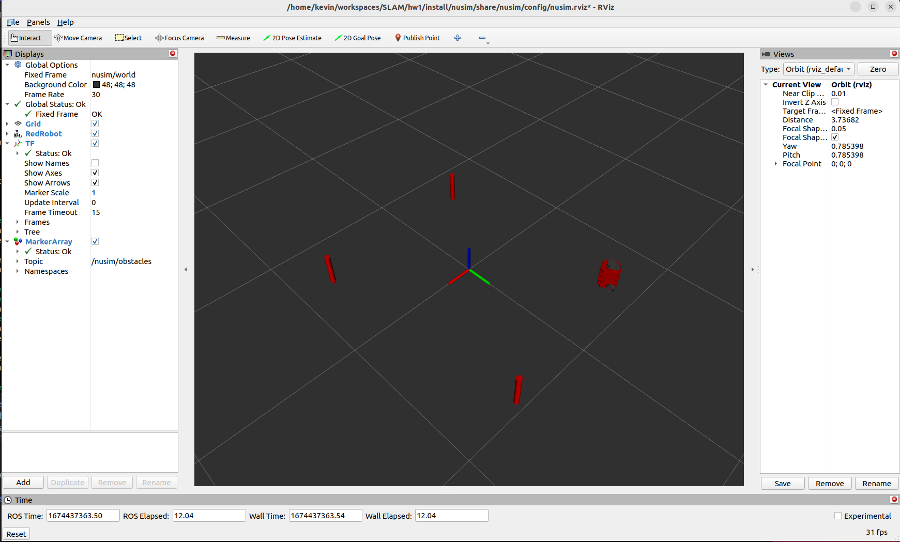

# NUsim

This package creates a simulation environment with obstacles for the nuturtle description package (turtlebot 3 burger).

# Launch File Details

The nusim.launch.xml launchfile launches an rviz window using the configuration nusim.rviz in the config directory. It includes the launchfile load_one.launch.py to load the red robot into the rviz environment, specifying use_rviz as no (since we are loading a separate rviz node), as well as the color as "red". Finally, the nusim node is launched, extracting parameters from the basic_world.yaml file.

# Parameters

The parameters in the aforementioned basic_world.yaml file are as follows

- obstacle positions (x and y values)
    - obstacles/x
    - obstacles/y
- obstacle radius
    - obstacles/r
- publishing rate
     - rate
- Initial turtlebot location and orientiation (x,y,theta)
    - x0
    - y0
    - theta0

# Screenshots

